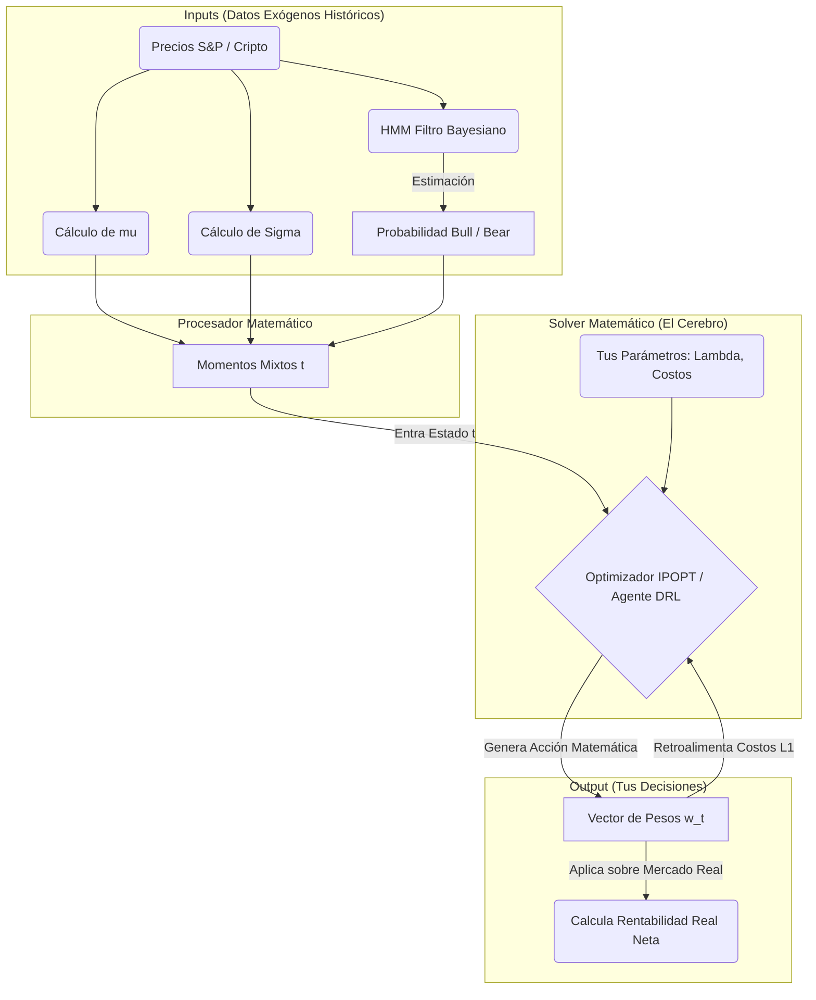

# Arquitectura Maestra: Entendiendo el Modelo GAMS y su Traducción al RL

Bienvenido a la Fase 1 formal del proyecto. Este documento está diseñado para ser tu "Biblia Matemática". Su propósito es desarticular el problema desde cero para que, cuando lleguemos a la fase de programación (Abril), entiendas exactamente qué significa cada variable que entra a las Redes Neuronales y por qué.

---

## 1. El Problema que estamos resolviendo (Visión General)
El problema subyacente es **Continuos Portfolio Allocation** (Asignación Continua de Portafolios). Como inversor, en cada instante de tiempo $t$ (una semana), posees una riqueza total cruzada y debes decidir qué porcentaje ($w_{i,t}$) de esa riqueza asignas al Activo 1 (Ej: S&P 500) y al Activo 2 (Ej: Criptomonedas / CMC200). 
La meta es maximizar la ganancia esperada, pero sin quebrar en el intento (minimizar la Varianza o Riesgo), y pagándole al broker lo menos posible por mover el dinero (Costos de Transacción).

---

## 2. El Modelo de Optimización (Planteado en GAMS)
El GAMS que nos pasó el profesor es un **optimizador determinista**. Su Función Objetivo (FO) ponderará toda la historia para encontrar el camino perfecto inyectando probabilidades de estados (Bear/Bull).

### 2.1 Ecuación de la Función Objetivo (GAMS)
$$ \max_{w_t} \quad \sum_{t=1}^T \left( \mathbf{w}_t^\top \boldsymbol{\mu}_t^{mix} \right) - \lambda \left( \mathbf{w}_t^\top \boldsymbol{\Sigma}_t^{mix} \mathbf{w}_t \right) - \sum_{i} c_i |w_{i,t} - w_{i,t-1}| $$

**Definición estricta de términos (Tus variables de control):**
1. $\mathbf{w}_t$ **(Lo que tú controlas / Salida de la IA):** El vector de pesos. Cuánto asignas al activo $i$. Siempre suma 1 (100% invertido).
2. $\boldsymbol{\mu}_t^{mix}$ **(El Retorno Esperado Mágico):** ¡Ojo aquí! Nadie sabe cuánto rentarán las acciones el viernes. GAMS usa un *Momentum Mixto*. 
   - Existen dos universos paralelos: Un "Bull Market" (mercado alcista, alta rentabilidad esperada) y un "Bear Market" (rutina de pánico, rentabilidad negativa).
   - $\mu_t^{mix} = (p\_bull \times \mu_t^{bull}) + (p\_bear \times \mu_t^{bear})$.
   - La serie estadística nos dice qué probabilidad ($p\_bull$ y $p\_bear$) tiene esa semana de estar en uno u otro escenario usando Matrices HMM.
3. $\boldsymbol{\Sigma}_t^{mix}$ **(El Riesgo Esperado):** Similar a la media, es la matriz de covarianza de esa semana. Si es alta, los activos son como una montaña rusa.
4. $\lambda$ **(Parámetro Parametrizable por Ti):** Tu factor de Aversión al Riesgo. 
   - Si $\lambda = 0$: Eres puramente codicioso, ignorarás la varianza e invertirás todo en Cripto aunque sea el Armagedón.
   - Si $\lambda = 5$: Te aterroriza la volatilidad. Preferirás ganar céntimos en un activo seguro en vez de arriesgar una caída del 2%.
5. $c_i$ **(Costos de Transacción L1):** La comisión del broker (Ej. 0.5% en el S&P 500 y 1.0% en Cripto). Está multiplicado por $|w_t - w_{t-1}|$, penalizándote estrictamente si rotas la cartera agresivamente en lugar de conservar.

---

## 3. Diagrama de Flujo Lógico y Dinámicas (GAMS vs RL)

¿Qué entra al optimizador y qué tiene que salir de él? He aquí el proceso ilustrado que codificaremos.

### 3.1 La Diferencia Principal que Resolveremos en la Tesis
*   **GAMS / IPOPT:** Mira todo el diagrama de arriba de una sola vez. Pone todos los miles de datos temporales en una súper-matriz inmensa y resuelve las derivadas parciales con matemáticas estériles para darte la línea de retornos matemáticamente perfecta que ningún humano real ganaría jamás.
*   **Red Neumoral PPO/SAC:** Actuará como un humano. Solo se le ingresará al bloque `IN` la historia de hasta 8 semanas en el pasado (`Frame Stacking`). Tendrá que adivinar probabilísticamente el futuro y escupir la salida en `OUT` asumiendo los costos, intentando emular instintivamente el comportamiento inmenso de GAMS.

---

## 4. Tareas del Usuario (Lo que debes parametrizar y controlar)
Lo genial de pasar la tesis ahora a nuestra estructura IPOPT / RL purgada es que ganarás un control sin precedentes. A lo largo del mes de Abril probarás sistemáticamente tu influencia en el entorno de inversión manipulando solamente estos tornillos lógicos:
1. **El nivel de Miedo ($\lambda$):** Para el análisis de sensibilidad cambiaremos a $\lambda=0.01, 1.5, 3.5$.
2. **Las "Tasas de Interés / Comisiones" ($c_i$):** Verificaremos qué le pasa al agente cuando el Exchange aumenta las comisiones de Cripto a 5%. ¿Se quedará estático?
3. **El Penalty de Exploración ($\eta_H \times Entropy$):** Un truco exclusivo del RL (no usado en GAMS) para que PPO no se "congele" en el día 1 metiendo todo su dinero en un solo lado por miedo, sino forzándolo a repartir su dinero para explorar todas las rentabilidades.
4. **La Frecuencia de Ventana Rodante:** ¿Qué pasa si el HMM para deducir Bear/Bull usa promedios de 100 semanas en vez de 52 semanas?

**Siguiente paso recomendado en nuestro plan maestro:** Codificar estrictamente el bloque "MOTOR" en `IPOPT` (Pyomo) para que, pasándole los números crudos del excel del profe, la simulación en Python arroje numéricamente el *exacto mismo* rendimiento final que a él. Eso será la prueba dorada de que dominas la matemática matricial subyacente.
