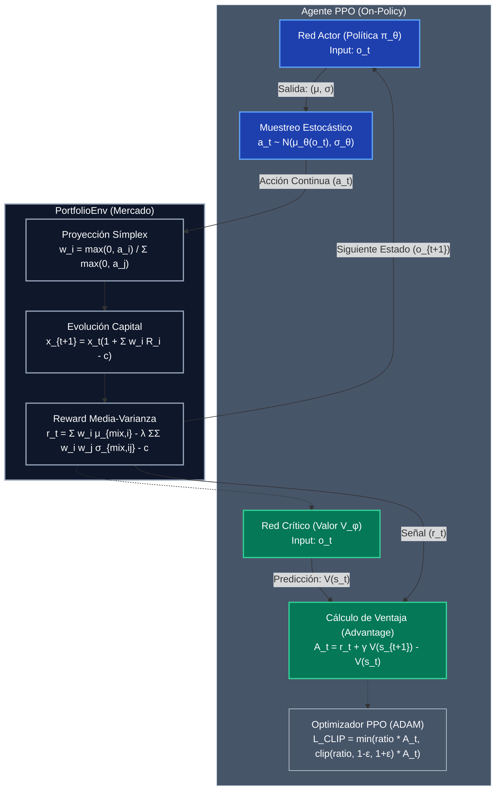

```mermaid
graph TD
    %% Estilos PPO
    classDef actor fill:#1E40AF,stroke:#60A5FA,stroke-width:2px,color:#fff;
    classDef critic fill:#047857,stroke:#34D399,stroke-width:2px,color:#fff;
    classDef env fill:#0F172A,stroke:#94A3B8,stroke-width:2px,color:#fff;
    classDef math fill:#475569,stroke:#CBD5E1,stroke-width:1px,color:#fff;

    subgraph Cerebro_PPO ["Agente PPO (On-Policy)"]
        Actor["Red Actor (Política π_θ)<br/>Input: o_t"]
        Critic["Red Crítico (Valor V_φ)<br/>Input: o_t"]
        
        Muestreo["Muestreo Estocástico<br/>a_t ~ N(μ_θ(o_t), σ_θ)"]
        Ventaja["Cálculo de Ventaja (Advantage)<br/>A_t = r_t + γ V(s_{t+1}) - V(s_t)"]
        
        Loss["Optimizador PPO (ADAM)<br/>L_CLIP = min(ratio * A_t, clip(ratio, 1-ε, 1+ε) * A_t)"]

        Actor -->|"Salida: (μ, σ)"| Muestreo
        Critic -->|"Predicción: V(s_t)"| Ventaja
        Ventaja -.-> Loss
    end
    class Actor,Muestreo actor
    class Critic,Ventaja critic
    class Loss,Cerebro_PPO math

    subgraph Entorno ["PortfolioEnv (Mercado)"]
        Proyeccion["Proyección Símplex<br/>w_i = max(0, a_i) / Σ max(0, a_j)"]
        Dinamica["Evolución Capital<br/>x_{t+1} = x_t(1 + Σ w_i R_i - c)"]
        Recompensa["Reward Media-Varianza<br/>r_t = Σ w_i μ_{mix,i} - λ ΣΣ w_i w_j σ_{mix,ij} - c"]
        
        Proyeccion --> Dinamica
        Dinamica --> Recompensa
    end
    class Entorno,Proyeccion,Dinamica,Recompensa env

    %% Conexiones Loop
    Muestreo -- "Acción Continua (a_t)" --> Proyeccion
    Recompensa -- "Señal (r_t)" --> Ventaja
    Recompensa -- "Siguiente Estado (o_{t+1})" --> Actor
    Recompensa -.-> Critic
```
