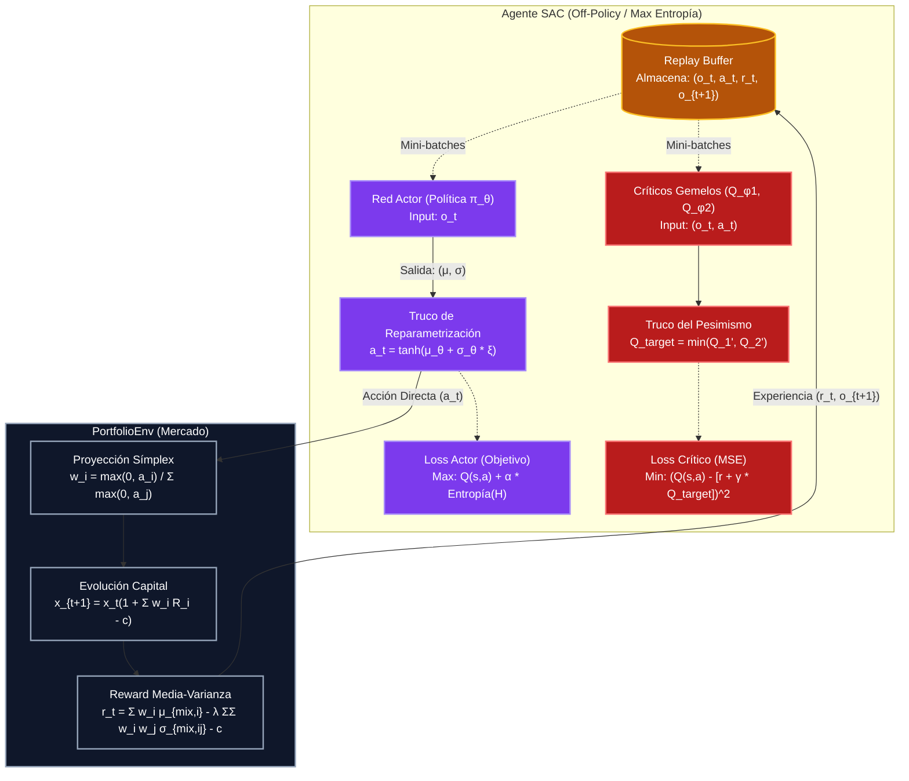

```mermaid
graph TD
    %% Estilos SAC
    classDef actor fill:#7C3AED,stroke:#A78BFA,stroke-width:2px,color:#fff;
    classDef critic fill:#B91C1C,stroke:#F87171,stroke-width:2px,color:#fff;
    classDef memory fill:#B45309,stroke:#FBBF24,stroke-width:2px,color:#fff;
    classDef env fill:#0F172A,stroke:#94A3B8,stroke-width:2px,color:#fff;
    classDef math fill:#475569,stroke:#CBD5E1,stroke-width:1px,color:#fff;

    subgraph Cerebro_SAC ["Agente SAC (Off-Policy / Max Entropía)"]
        Buffer[("Replay Buffer<br/>Almacena: (o_t, a_t, r_t, o_{t+1})")]
        
        Actor["Red Actor (Política π_θ)<br/>Input: o_t"]
        Reparam["Truco de Reparametrización<br/>a_t = tanh(μ_θ + σ_θ * ξ)"]
        
        Critic["Críticos Gemelos (Q_φ1, Q_φ2)<br/>Input: (o_t, a_t)"]
        Pesimismo["Truco del Pesimismo<br/>Q_target = min(Q_1', Q_2')"]
        
        LossActor["Loss Actor (Objetivo)<br/>Max: Q(s,a) + α * Entropía(H)"]
        LossCritic["Loss Crítico (MSE)<br/>Min: (Q(s,a) - [r + γ * Q_target])^2"]

        Buffer -.->|"Mini-batches"| Actor
        Buffer -.->|"Mini-batches"| Critic
        Actor -->|"Salida: (μ, σ)"| Reparam
        Critic --> Pesimismo
        Pesimismo -.-> LossCritic
        Reparam -.-> LossActor
    end
    class Actor,Reparam,LossActor actor
    class Critic,Pesimismo,LossCritic critic
    class Buffer memory

    subgraph Entorno ["PortfolioEnv (Mercado)"]
        Proyeccion["Proyección Símplex<br/>w_i = max(0, a_i) / Σ max(0, a_j)"]
        Dinamica["Evolución Capital<br/>x_{t+1} = x_t(1 + Σ w_i R_i - c)"]
        Recompensa["Reward Media-Varianza<br/>r_t = Σ w_i μ_{mix,i} - λ ΣΣ w_i w_j σ_{mix,ij} - c"]
        
        Proyeccion --> Dinamica
        Dinamica --> Recompensa
    end
    class Entorno,Proyeccion,Dinamica,Recompensa env

    %% Conexiones Loop
    Reparam -- "Acción Directa (a_t)" --> Proyeccion
    Recompensa -- "Experiencia (r_t, o_{t+1})" --> Buffer
```
